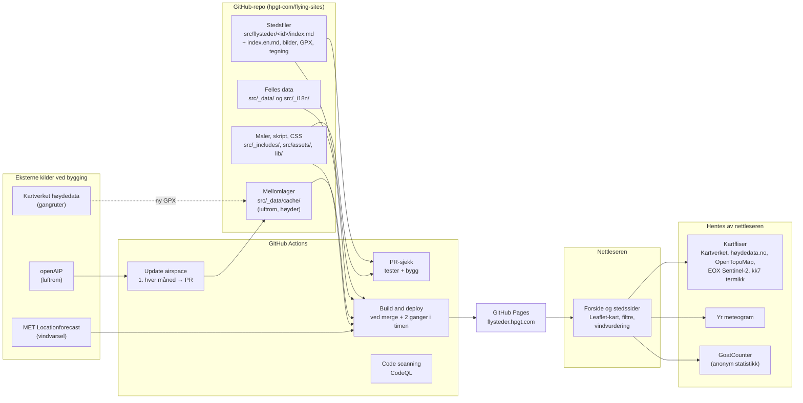
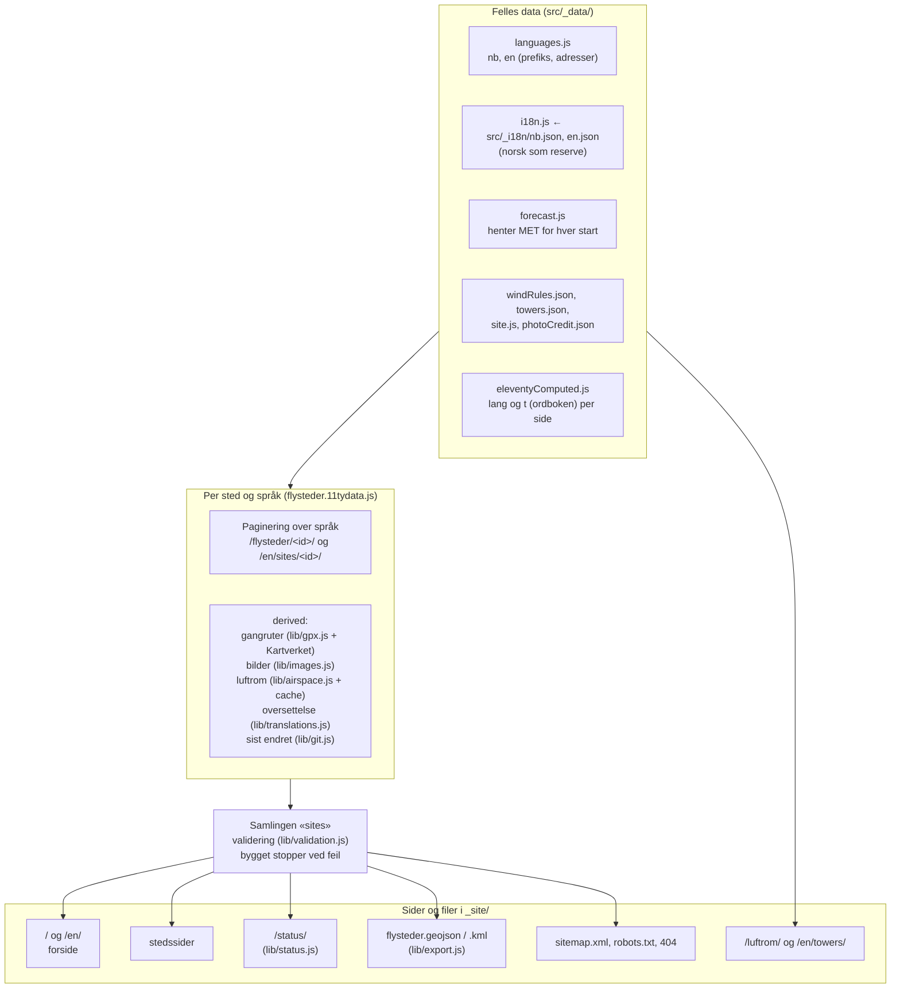
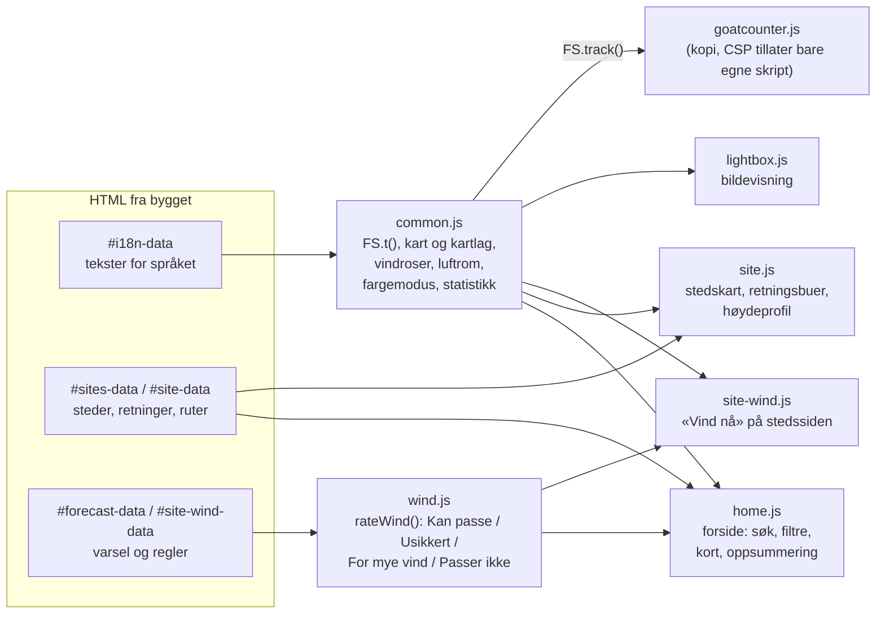
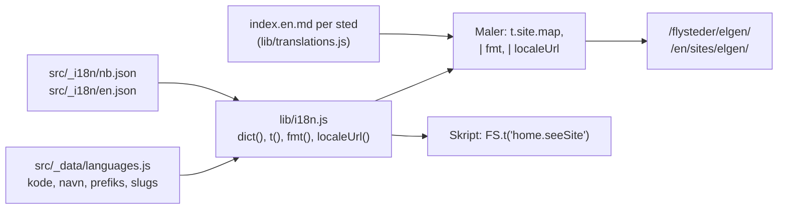
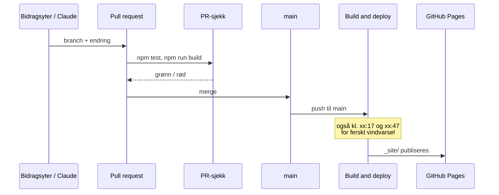
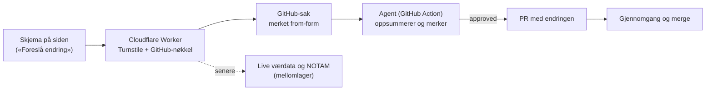

# Arkitektur

Hvordan flysteder.hpgt.com er bygget opp: hvor dataene kommer fra, hva som skjer når siden bygges, og hva som
kjører i nettleseren. Tegningene er Mermaid og vises som diagrammer på GitHub.

Kort fortalt: **en statisk side uten server og database.** Alt innhold ligger som filer i repoet. GitHub Actions
bygger siden med Eleventy og publiserer den på GitHub Pages, to ganger i timen og ved hver endring. Det som skal
være ferskt (vindvarselet), hentes når siden bygges. Det som tar tid å hente (luftrom, høyder), mellomlagres i
repoet.

## Oversikt

- **Innhold er filer.** Hvert sted er én mappe. Endringer går via pull request, og PR-sjekken stopper ugyldige
  stedsfiler før de kommer ut.
- **Automatiske importer skriver aldri i stedsfilene**, bare i `src/_data/cache/`. Luftrom kommer som egen PR
  som gjennomgås.
- **Ingen hemmeligheter i nettleseren.** Den eneste nøkkelen (`OPENAIP_API_KEY`) brukes bare i workflowen.

## Bygget

Eleventy leser dataene i en fast rekkefølge (data cascade) og lager én HTML-side per side og språk.

| Del | Hvor | Hva den gjør |
|---|---|---|
| Stedsdata | `src/flysteder/<id>/index.md` | Front matter (strukturerte data) og Markdown-tekst. Se [stedsfiler.md](stedsfiler.md). |
| Validering | `lib/validation.js` | Ukjente nøkler, ugyldige retninger, nivåer og kategorier, bilder med feil navn, gangruter som mangler. Feil stopper bygget. |
| Gangruter | `lib/gpx.js` | Lengde, stigning, bevegelsestid og høydeprofil. Høyder fra Kartverket, mellomlagret per fil i `src/_data/cache/elevations/`. |
| Bilder | `lib/images.js`, `lib/site-images.js` | WebP/JPEG i 400–2400 px uten metadata, fotograf og lisens skrevet inn. Bildene finnes ut fra filnavnet. |
| Luftrom | `lib/airspace.js`, `scripts/update-airspace.mjs` | openAIP per start, «taket» over starten, merknader fra stedsfilen. Kartlaget bruker `region.geojson`. |
| Vindvarsel | `src/_data/forecast.js` | 48 timer vind, kast og nedbør per start fra MET. Feiler et sted, mangler bare det. |
| Språk | `lib/i18n.js`, `lib/translations.js` | Ordbøker, adresser per språk og oversatt stedstekst. Se under. |
| Status | `lib/status.js` | Hva som mangler per sted, til `/status/`. |
| Åpne data | `lib/export.js` | GeoJSON og KML med starter, landinger, parkering og gangruter (CC BY 4.0). |

## I nettleseren

Sidene virker uten JavaScript for det viktigste (tekst, bilder, lenker). Skriptene legger på kart, filtre og
vindvurdering. Dataene ligger som JSON i siden (`<script type="application/json">`), så skriptene ikke trenger å
hente noe fra siden selv.

- **Vindvurderingen** (`wind.js`) er ren logikk uten DOM og testes i `test/wind.test.js`. Reglene står i
  `src/_data/windRules.json`. Den gir både tekst og koder (`gust`, `rain`, `overSiteLimit` …), så forsiden kan
  telle årsaker uavhengig av språk. Den sier aldri «OK å fly».
- **Kategori og retning henger sammen:** med SPG valgt brukes retningene til startene som er merket SPG
  (`categoryDirections` i `lib/format.js`), i filteret, rosen og vurderingen.
- **Sikkerhet:** Content-Security-Policy i `base.njk` tillater bare skript fra siden selv, og bilder og data fra
  kildene over. Ny ekstern kilde må legges inn der. Se [SECURITY.md](../SECURITY.md).

## Språk

- **Norsk er hovedspråket** og har ingen prefiks. Andre språk ligger under eget prefiks (`/en/`), med egne navn på
  adressene (`slugs`: `flysteder` → `sites`, `luftrom` → `towers`). `localeUrl` oversetter adresser begge veier,
  og brukes av språkvalget i menyen, hreflang og sitemap.
- **Fast tekst** (meny, filtre, overskrifter, meldinger i skriptene) står i ordbøkene. Det som mangler i et språk,
  hentes fra `nb.json`. `test/i18n.test.js` sjekker at alle oppslag i maler og skript finnes.
- **Stedstekst** oversettes i `index.<språk>.md` ved siden av `index.md`. Bare tekst: koordinater, nivå og retninger
  hentes alltid fra `index.md`. Mangler oversettelsen, vises den norske teksten med en merknad. Statussiden viser
  steder uten oversettelse, og oversettelser som er eldre enn den norske teksten.
- **Nytt språk:** se [drift.md](drift.md#legge-til-et-språk).

## Publisering og arbeidsflyt

| Workflow | Når | Hva |
|---|---|---|
| `pr-check.yml` | Hver PR | Tester og bygg (`build`), dependency review (pakker med kjente sårbarheter) og zizmor (sikkerhet i workflowene). |
| `deploy.yml` | Push til `main`, kl. xx:17 og xx:47, manuelt | Bygger med ferskt MET-varsel og publiserer. Henter hele Git-historikken for «sist endret». |
| `airspace.yml` | Den 1. hver måned, manuelt | Henter luftrom fra openAIP og lager PR hvis noe er endret. |
| `code-scanning.yml` | PR, push, mandager | CodeQL (sikkerhetsfeil i koden). |
| Dependabot | Månedlig | PR-er med oppdaterte pakker og Actions. |

## Hva som er bygget

Hovedtrekkene, i grove trekk i rekkefølgen de kom til. Detaljene står i [SPEC.md](../SPEC.md) og i PR-ene.

- **Grunnmur:** Eleventy-side på GitHub Pages som erstatter den gamle iframe-oversikten. Én fil per sted med
  validering, fast sidemal, Leaflet-kart med Kartverket som bakgrunn, mørk modus og fargeblindvennlige farger.
- **Forsiden:** kart med vindroser og klynger, søk, filtre for retning, nivå og kategori, kort for valgt sted,
  faner for Flysteder, Vær og Info.
- **Vindvurdering fra MET:** «Kan passe», «Usikkert», «For mye vind», «Passer ikke» for nå, +3 t, +6 t og i
  morgen, med oppsummering som følger filtrene, og «Vind nå» på stedssidene. Slås av når varselet er for gammelt.
- **Stedssidene:** kart med starter, retningsbuer, landinger, parkering, gangruter og nummererte punkter fra
  tegningen, høydeprofil fra Kartverket, farer, fakta, luftrom over starten, Yr-meteogram og bildevisning.
- **Data og kvalitet:** Kartverket-høyder for start, landing og parkering, gjennomgang av alle 32 stedene,
  statussiden med sjekker for manglende innhold, åpne data (GeoJSON/KML).
- **Luftrom:** openAIP-lag i kartet (CTA/TMA, CTR, militære områder, fare og restriksjon) med feilmelding og
  «Prøv igjen», månedlig oppdatering via PR, tårnsiden.
- **Bilder:** import med fast navngiving, nedskalering og fotograf/lisens i metadata.
- **Deling og statistikk:** forhåndsvisning på Facebook/Messenger, sitemap og hreflang, anonym statistikk
  med GoatCounter (sider og klikk, uten informasjonskapsler).
- **Språk:** norsk og engelsk, med engelsk tekst for alle stedene, og struktur for flere språk.

## Planlagt

- **Skjema for endringer** uten GitHub-konto, via en Cloudflare Worker som oppretter saken og svarer med lenke
  til den. En agent oppsummerer saken, og lager endringen som PR når den er merket `approved`.
- **Live værdata** fra klubbens og Modellflyklubbens stasjoner, og **NOTAM** som eget kartlag. Begge trenger et
  mellomledd på en server (samme Worker, eller Cloudflare Pages Functions hvis siden flyttes dit).
